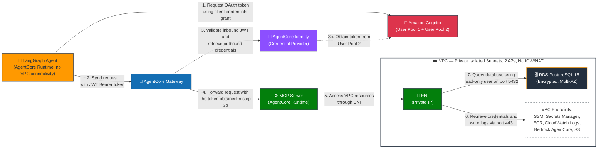

# Accessing Private VPC Resources with AI Agents Using Amazon Bedrock AgentCore

An Ad Platform Campaign MCP Server with LangGraph agent deployed on Amazon Bedrock AgentCore. This project provisions a private VPC with PostgreSQL RDS, deploys an MCP server to AgentCore Runtime with VPC connectivity for campaign data queries, and connects it to a LangGraph agent via AgentCore Gateway with Cognito M2M authentication.

---

## Table of Contents

1. [Architecture](#1-architecture)
2. [Prerequisites](#2-prerequisites)
   - 2.1 [Required Tools](#21-required-tools)
   - 2.2 [AWS Account Requirements](#22-aws-account-requirements)
   - 2.3 [AWS Credentials Configuration](#23-aws-credentials-configuration)
3. [Environment Setup](#3-environment-setup)
   - 3.1 [Option A: Conda (Recommended)](#31-option-a-conda-recommended)
   - 3.2 [Option B: pip + venv (Fallback)](#32-option-b-pip--venv-fallback)
   - 3.3 [Session Manager Plugin](#33-session-manager-plugin)
4. [Step-by-Step Deployment](#4-step-by-step-deployment)
   - 4.0 [Step 0: Availability Zone Configuration & Pre-Deployment Checks](#40-step-0-availability-zone-configuration--pre-deployment-checks)
   - 4.1 [Step 1: Deploy Infrastructure (CDK)](#41-step-1-deploy-infrastructure-cdk)
   - 4.2 [Step 2: Setup Database](#42-step-2-setup-database)
   - 4.3 [Step 3: Deploy MCP Server](#43-step-3-deploy-mcp-server)
   - 4.4 [Step 4: Deploy Agent](#44-step-4-deploy-agent)
5. [Verification](#5-verification)
6. [Cleanup](#6-cleanup)
7. [Troubleshooting](#7-troubleshooting)
8. [Platform Support](#8-platform-support)
9. [Project Structure](#9-project-structure)
10. [Appendices](#10-appendices)
    - A. [Original README (Before)](#appendix-a-original-readme-before)
    - B. [Changes from Original](#appendix-b-changes-from-original)
    - C. [Conda Environment Packages](#appendix-c-conda-environment-packages)
    - D. [SSM Parameter Reference](#appendix-d-ssm-parameter-reference)

---

## 1. Architecture



**Data flow:** Agent → Gateway (Cognito auth) → MCP Server (Cognito auth) → PostgreSQL RDS

---

## 2. Prerequisites

### 2.1 Required Tools

| Tool | Min Version | Purpose | Install |
|---|---|---|---|
| Node.js | 18+ | CDK synthesis and deployment | [nodejs.org](https://nodejs.org) |
| npm | 8+ | Node.js package management | Included with Node.js |
| AWS CLI | v2 | AWS API operations | [Install guide](https://docs.aws.amazon.com/cli/latest/userguide/install-cliv2.html) |
| AWS CDK | 2.120+ | Infrastructure as Code | `npm install -g aws-cdk` |
| Conda | latest | Environment management (recommended) | [Install Miniconda](https://docs.conda.io/projects/miniconda/en/latest/) |
| jq | 1.5+ | JSON parsing for database password extraction | [jqlang.github.io](https://jqlang.github.io/jq/download/) |

> **Note:** Python 3.13, psql 17, agentcore CLI, and all Python dependencies are installed automatically via the conda environment (see §3.1).

### 2.2 AWS Account Requirements

- IAM permissions for: CDK, CloudFormation, EC2, VPC, RDS, Cognito, SSM, Secrets Manager, IAM, Bedrock AgentCore
- Access to Anthropic Claude Sonnet 4.5 (`us.anthropic.claude-sonnet-4-5-20250929-v1:0`) in `us-east-1`
- CDK bootstrapped in target account/region

### 2.3 AWS Credentials Configuration

All Python scripts support `--profile <name>` argument and `AWS_PROFILE` environment variable. All bash scripts support `--profile <name>` and `AWS_PROFILE`. If neither is set, the default credential chain applies.

```bash
# Option A: Named profile (recommended — no credential leakage, multi-account safe)
export AWS_PROFILE=<your-profile>

# Option B: aws configure (sets persistent defaults in ~/.aws/credentials)
aws configure
# Prompts: Access Key ID, Secret Access Key, Region (us-east-1), Output (json)

# Verify (whichever method you chose)
aws sts get-caller-identity
```

| Method | Best For | Persists |
|---|---|---|
| `AWS_PROFILE` env var | Multiple accounts, ada/Isengard users | Session only |
| `--profile <name>` arg | Per-command override | No |
| `aws configure` | Single account, simple setup | Yes (~/.aws/credentials) |

---

## 3. Environment Setup

### 3.1 Conda 

Creates an isolated environment with Python 3.13, PostgreSQL client 17.6, agentcore CLI, and all project dependencies. Works on Linux, macOS, and Windows.

```bash
# --file: path to environment definition
# Creates env named 'ads-mcp-agent' as defined in environment.yml
conda env create --file environment.yml

# Activate the environment
conda activate ads-mcp-agent

# Verify installation
python3 -c "
import importlib.metadata, subprocess, sys
tools = {
    'python': sys.version.split()[0],
    'psql': subprocess.run(['psql','--version'], capture_output=True, text=True).stdout.strip().split()[-1],
    'boto3': importlib.metadata.version('boto3'),
    'agentcore': importlib.metadata.version('bedrock-agentcore-starter-toolkit'),
    'langgraph': importlib.metadata.version('langgraph'),
    'mcp': importlib.metadata.version('mcp'),
}
for name, ver in tools.items():
    print(f'  {name:20s} {ver}')
"
```

### 3.2 Option B: pip + venv (Fallback)

Use if conda is not available: 

```bash
cd mcp-server
python3 -m venv venv

# Activate
source venv/bin/activate          # Linux / macOS
# venv\Scripts\activate           # Windows

pip install --upgrade pip
pip install -r requirements-local.txt

# You need to run following command to install PostgreSQL client separately for your OS.
# macOS
brew install postgresql

# Ubuntu/Debian
sudo apt install postgresql-client

# Amazon Linux
sudo yum install postgresql15 
```

### 3.3 Session Manager Plugin

Required for SSM port forwarding to the RDS database (Step 2). This is a system-level install — not available via conda or pip.

| Platform | Install Command |
|---|---|
| **Linux (RPM — AL2, RHEL 7)** | `sudo yum install -y https://s3.amazonaws.com/session-manager-downloads/plugin/latest/linux_64bit/session-manager-plugin.rpm` |
| **Linux (RPM — AL2023, RHEL 8/9)** | `sudo dnf install -y https://s3.amazonaws.com/session-manager-downloads/plugin/latest/linux_64bit/session-manager-plugin.rpm` |
| **Linux (DEB — Ubuntu, Debian)** | `curl -s "https://s3.amazonaws.com/session-manager-downloads/plugin/latest/ubuntu_64bit/session-manager-plugin.deb" -o ssm.deb && sudo dpkg -i ssm.deb && rm ssm.deb` |
| **macOS (ARM — M1/M2/M3)** | `curl -s "https://s3.amazonaws.com/session-manager-downloads/plugin/latest/mac_arm64/sessionmanager-bundle.zip" -o ssm.zip && unzip ssm.zip && sudo ./sessionmanager-bundle/install -i /usr/local/sessionmanagerplugin -b /usr/local/bin/session-manager-plugin && rm -rf sessionmanager-bundle ssm.zip` |
| **macOS (Intel)** | `curl -s "https://s3.amazonaws.com/session-manager-downloads/plugin/latest/mac/sessionmanager-bundle.zip" -o ssm.zip && unzip ssm.zip && sudo ./sessionmanager-bundle/install -i /usr/local/sessionmanagerplugin -b /usr/local/bin/session-manager-plugin && rm -rf sessionmanager-bundle ssm.zip` |
| **Windows** | Download and run [SessionManagerPluginSetup.exe](https://s3.amazonaws.com/session-manager-downloads/plugin/latest/windows/SessionManagerPluginSetup.exe) |

```bash
# Verify (all platforms)
session-manager-plugin --version
```

---

## 4. Step-by-Step Deployment

### 4.0 Step 0: Availability Zone Configuration & Pre-Deployment Checks

> **Note:** This project is designed for **us-east-1** region. The CDK stack, AgentCore runtime, and Bedrock model configurations are all configured for us-east-1.

#### Pre-Deployment Check

**VPC quota** (default limit: 5 per region — [AWS docs](https://docs.aws.amazon.com/vpc/latest/userguide/amazon-vpc-limits.html))

```bash
aws ec2 describe-vpcs --region us-east-1 --query 'Vpcs | length(@)' --output text
```

If the result is 5 or close to 5, either delete unused VPCs or [request a quota increase](https://console.aws.amazon.com/servicequotas/).

#### Availability Zone Configuration

Each AWS account maps AZ names to zone IDs differently. You must find your mapping before deploying. [Amazon Bedrock AgentCore supports VPC connectivity in specific Availability Zones within each supported region](https://docs.aws.amazon.com/bedrock-agentcore/latest/devguide/agentcore-vpc.html#agentcore-supported-azs). When configuring subnets for your Amazon Bedrock AgentCore Runtime and built-in tools, ensure that your subnets are located in the supported Availability Zones for your region. 

**Note:** must run the following steps, find AZ names mapping to use1-az1 and use1-az2, and update ```rds-stacks.ts``` before step 4.1:

```bash
aws ec2 describe-availability-zones \
    --region us-east-1 \
    --query 'AvailabilityZones[?ZoneId==`use1-az1` || ZoneId==`use1-az2`].[ZoneName,ZoneId]' \
    --output table
```

Edit `rds-stack.ts` line 20 with your AZ names:

```typescript
// Replace with your account's AZ names for use1-az1 and use1-az2
// example after update: availabilityZones: ['us-east-1a', 'us-east-1b']
availabilityZones: ['<your-az1>', '<your-az2>'], 
```

### 4.1 Step 1: Deploy Infrastructure (CDK)

```bash
# Bootstrap CDK (once per account/region)
cdk bootstrap

# Install Node.js dependencies
npm install

# Build TypeScript and deploy all stacks
npm run build
cdk deploy --all
```

> To skip manual approval prompts: ```cdk deploy --all --require-approval never```

**What this creates:** VPC (private subnets, 9 VPC endpoints), RDS PostgreSQL 15 (encrypted, private), EC2 bastion (SSM-managed), security groups, SSM parameters.

### 4.2 Step 2: Setup Database

Requires **two terminals** running simultaneously.

**Terminal 1 — Start SSM port forwarding (keep running):**

```bash
INSTANCE_ID=$(aws ssm get-parameter --name /campaign/db-access-instance-id --query Parameter.Value --output text)
DB_ENDPOINT=$(aws ssm get-parameter --name /campaign/db-endpoint --query Parameter.Value --output text)

aws ssm start-session \
    --target $INSTANCE_ID \
    --document-name AWS-StartPortForwardingSessionToRemoteHost \
    --parameters "{\"host\":[\"$DB_ENDPOINT\"],\"portNumber\":[\"5432\"],\"localPortNumber\":[\"5432\"]}"
```

**Terminal 2 — Create schema and load data:**

```bash
# Get database password
SECRET_ARN=$(aws ssm get-parameter --name /campaign/db-credentials-arn --query Parameter.Value --output text)
DB_PASSWORD=$(aws secretsmanager get-secret-value --secret-id $SECRET_ARN --query SecretString --output text | jq -r .password)
echo "Password: $DB_PASSWORD"

# Create table and insert data (enter password when prompted)
psql -h localhost -p 5432 -U dbadmin -d campaigndb -f create-campaign-table.sql
psql -h localhost -p 5432 -U dbadmin -d campaigndb -f insert-sample-data.sql

# Verify (expected: 10 rows)
psql -h localhost -p 5432 -U dbadmin -d campaigndb -c "SELECT COUNT(*) FROM campaign;"
```

### 4.3 Step 3: Deploy MCP Server

```bash
cd mcp-server

# Setup Cognito authentication for MCP server runtime
python setup_cognito.py

# Deploy MCP server to AgentCore Runtime with VPC connectivity
./deploy.sh                    # Linux / macOS
# bash deploy.sh               # Windows (WSL2 / Git Bash)

# Create AgentCore Gateway with Cognito auth
python create_gateway.py

# Register MCP server as gateway target
python add_gateway_target.py
```

> **With named profile:** `python setup_cognito.py --profile <name>` or `./deploy.sh --profile <name>`

### 4.4 Step 4: Deploy Agent

```bash
cd ../langraph

# Deploy LangGraph agent to AgentCore Runtime
./deploy.sh                    # Linux / macOS
# bash deploy.sh               # Windows (WSL2 / Git Bash)

# Test agent
python test_agent.py
```

---

## 5. Verification

| Check | Command | Expected |
|---|---|---|
| Database | `psql -h localhost -p 5432 -U dbadmin -d campaigndb -c "SELECT COUNT(*) FROM campaign;"` | 10 |
| MCP Runtime | `agentcore status --verbose` (in mcp-server/) | status: READY |
| Gateway targets | Check gateway target status in AgentCore console | ACTIVE |
| Agent | `python test_agent.py` (in langraph/) | JSON response with campaign data |

---

## 6. Cleanup

Run in order:

```bash
# 1. Remove agent on AgentCore Runtime
cd ../langraph
python cleanup_agent.py

# 2. Remove AgentCore resources (MCP server, gateway, Cognito pools, SSM params)
cd ../mcp-server
python cleanup_all.py

# 3. Remove infrastructure (VPC, RDS, EC2, endpoints)
# NOTE: Deletion protection is enabled on RDS. Disable it before destroying:
cd ..
# Find your RDS instance identifier:
aws rds describe-db-instances --query 'DBInstances[?DBName==`campaigndb`].DBInstanceIdentifier' --output text
# Disable deletion protection (replace <instance-id> with the output above):
aws rds modify-db-instance --db-instance-identifier <instance-id> --no-deletion-protection
# Wait ~1 minute for the modification to apply, then:
cdk destroy
```

---

## 7. Troubleshooting

| Issue | Cause | Fix |
|---|---|---|
| `cdk deploy` fails with invalid AZ | Placeholder `us-east-1x` not replaced | Run Step 0 to find your AZ mapping |
| `cdk destroy` fails with "Cannot delete protected DB Instance" | RDS deletion protection is enabled | Run `aws rds modify-db-instance --db-instance-identifier <id> --no-deletion-protection` first |
| `psql: command not found` | PostgreSQL client not installed | Activate conda env: `conda activate ads-mcp-agent` |
| `session-manager-plugin: command not found` | Plugin not installed | See §3.3 for platform-specific install |
| `agentcore: command not found` | AgentCore CLI not installed | Activate conda env: `conda activate ads-mcp-agent` |
| `ExpiredToken` error | AWS credentials expired | Refresh: `export AWS_PROFILE=<profile>` or `aws configure` |
| Port 5432 already in use | Local PostgreSQL running | Stop local PG or change `localPortNumber` in SSM command |
| `deploy.sh` fails on Windows | Bash required | Use WSL2: `wsl bash deploy.sh` |
| Cognito/Gateway already exists | Re-running setup scripts | Run `python cleanup_all.py` first |
| `pip install` fails with NumPy build error | Old GCC on AL2 | Use conda env (installs pre-built NumPy) |

---

## 8. Platform Support

| Platform | Support | Notes |
|---|---|---|
| macOS (ARM/Intel) | ✅ Full | Primary development target |
| Linux (Cloud Desktop / AL2) | ✅ Full | Use conda env for psql + agentcore |
| Linux (Ubuntu/Debian) | ✅ Full | Use conda env or apt for psql |
| Windows (WSL2) | ✅ Full | Follow Linux instructions inside WSL |
| Windows (native) | ❌ Not supported | `deploy.sh` scripts require bash |

---

## 9. Project Structure

```
amazon-ads-custom-mcp-server-agent/
├── README.md                       # This file
├── environment.yml                 # Conda environment (cross-platform)
├── app.ts                          # CDK app entry point
├── rds-stack.ts                    # CDK stack: VPC, RDS, SGs, VPC endpoints, SSM params
├── package.json                    # Node.js dependencies (CDK)
├── tsconfig.json                   # TypeScript compiler config
├── cdk.json                        # CDK feature flags
├── create-campaign-table.sql       # Database schema + indexes + trigger
├── insert-sample-data.sql          # 10 sample campaign records
├── mcp-server/
│   ├── server.py                   # MCP server (FastMCP + PostgreSQL tools)
│   ├── aws_session.py              # Shared AWS session helper (--profile support)
│   ├── deploy.sh                   # Deploy MCP server to AgentCore Runtime with VPC connectivity
│   ├── setup_cognito.py            # Create Cognito pool for Gateway → MCP Server auth (inbound to MCP)
│   ├── create_gateway.py           # Create AgentCore Gateway + Cognito pool for Agent → inbound to Gateway auth + IAM role
│   ├── add_gateway_target.py       # Register MCP as target + create OAuth2 IDP (Gateway uses this to authenticate with MCP Server)
│   ├── cleanup_all.py              # Remove all AgentCore resources (8 steps)
│   ├── requirements.txt            # Runtime dependencies (deployed to AgentCore)
│   └── requirements-local.txt      # Dev/local dependencies (pip fallback)
└── langraph/
    ├── agent.py                    # LangGraph agent (FastAPI + Bedrock Claude)
    ├── aws_session.py              # Shared AWS session helper
    ├── test_agent.py               # Agent smoke test
    ├── deploy.sh                   # Deploy agent to AgentCore Runtime
    ├── cleanup_agent.py            # Remove agent runtime
    └── requirements.txt            # Agent dependencies
```

---

## 10. Appendices

### Appendix A: Original README (Before)

The original README had the following gaps identified during code review:

| Issue | Original | This Version |
|---|---|---|
| No table of contents | Jumped straight into install commands | Full TOC with 10 sections + 4 appendices |
| No architecture diagram | None | ASCII diagram with data flow |
| No prerequisites table | Scattered install commands | Versioned table with all tools |
| macOS-only installs | `brew install postgresql`, ARM-only SSM URL | Cross-platform: conda, RPM, DEB, EXE |
| `agentcore` not mentioned | Missing entirely | Included in conda env + prerequisites |
| No credential guidance | Only `aws configure` | 3 methods: AWS_PROFILE, --profile, aws configure |
| `jq` not listed | Used but not documented | Listed in prerequisites |
| Step numbering error | Two "Step 3" sections | Fixed: Steps 0-4 |
| No verification section | Only DB check | 4-point verification table |
| No cleanup in main flow | Cleanup buried at end | Dedicated §6 with ordered steps |
| No troubleshooting | None | 9-row troubleshooting table |
| No platform support info | None | Support matrix for 5 platforms |
| No project structure | None | Full tree with descriptions |
| No environment.yml | Manual venv + pip | Conda env with all deps + psql |

### Appendix B: Changes from Original

Files added or modified from the original repository:

| File | Change | Reason |
|---|---|---|
| `environment.yml` | **NEW** | Cross-platform conda env with Python 3.13, psql 17, all deps |
| `mcp-server/aws_session.py` | **NEW** | Shared AWS session helper with --profile support |
| `langraph/aws_session.py` | **NEW** | Copy of above for langraph directory |
| `rds-stack.ts` | **MODIFIED** | AZ placeholder replaced with actual values |
| `mcp-server/setup_cognito.py` | **MODIFIED** | Added --profile arg via aws_session |
| `mcp-server/create_gateway.py` | **MODIFIED** | Added --profile arg via aws_session |
| `mcp-server/add_gateway_target.py` | **MODIFIED** | Added --profile arg via aws_session |
| `mcp-server/cleanup_all.py` | **MODIFIED** | Added AWS_PROFILE env var support |
| `mcp-server/deploy.sh` | **MODIFIED** | Added --profile / AWS_PROFILE support |
| `langraph/deploy.sh` | **MODIFIED** | Added --profile / AWS_PROFILE support |
| `langraph/test_agent.py` | **MODIFIED** | Added AWS_PROFILE env var support |
| `langraph/cleanup_agent.py` | **MODIFIED** | Added AWS_PROFILE env var support |

### Appendix C: Conda Environment Packages

Packages installed by `conda env create --file environment.yml`:

| Package | Version | Source | Purpose |
|---|---|---|---|
| python | 3.13 | conda | Runtime |
| postgresql | 17.6 | conda | psql client for database setup |
| numpy | latest | conda | Pre-built binary (avoids GCC issues on AL2) |
| mcp | 1.27.0 | pip | MCP server framework |
| asyncpg | 0.31.0 | pip | Async PostgreSQL driver |
| boto3 | 1.42.85 | pip | AWS SDK |
| bedrock-agentcore-starter-toolkit | 0.3.4 | pip | AgentCore CLI (`agentcore` command) |
| bedrock-agentcore | 1.6.0 | pip | AgentCore SDK |
| langgraph | 1.1.6 | pip | LangGraph agent framework |
| langchain-aws | 1.4.3 | pip | Bedrock LLM integration |
| langchain-mcp-adapters | 0.2.2 | pip | MCP tool adapters for LangChain |
| fastapi | 0.135.3 | pip | Agent HTTP server |
| uvicorn | 0.44.0 | pip | ASGI server |
| requests | 2.33.1 | pip | HTTP client |
| pyyaml | 6.0.3 | pip | YAML parsing |

### Appendix D: SSM Parameter Reference

Parameters created during deployment, stored in AWS Systems Manager Parameter Store under `/campaign/`:

**Infrastructure (created by CDK — Step 1):**

| Parameter | Type | Created By |
|---|---|---|
| `/campaign/private-subnet-ids` | String | CDK |
| `/campaign/mcp-sg-id` | String | CDK |
| `/campaign/db-endpoint` | String | CDK |
| `/campaign/db-credentials-arn` | String | CDK |
| `/campaign/db-access-instance-id` | String | CDK |

**MCP Server (created by Steps 3 scripts):**

| Parameter | Type | Created By |
|---|---|---|
| `/campaign/mcp-runtime-user-pool-id` | String | setup_cognito.py |
| `/campaign/mcp-runtime-client-id` | String | setup_cognito.py |
| `/campaign/mcp-runtime-client-secret` | SecureString | setup_cognito.py |
| `/campaign/mcp-runtime-discovery-url` | String | setup_cognito.py |
| `/campaign/mcp-runtime-scope` | String | setup_cognito.py |
| `/campaign/mcp-runtime-id` | String | deploy.sh |
| `/campaign/mcp-runtime-arn` | String | deploy.sh |
| `/campaign/gateway-id` | String | create_gateway.py |
| `/campaign/gateway-url` | String | create_gateway.py |
| `/campaign/gateway-user-pool-id` | String | create_gateway.py |
| `/campaign/gateway-client-id` | String | create_gateway.py |
| `/campaign/gateway-client-secret` | SecureString | create_gateway.py |
| `/campaign/gateway-scope` | String | create_gateway.py |
| `/campaign/gateway-target-id` | String | add_gateway_target.py |
| `/campaign/gateway-credential-provider-arn` | String | add_gateway_target.py |

**Agent (created by Step 4):**

| Parameter | Type | Created By |
|---|---|---|
| `/campaign/agent-runtime-arn` | String | langraph/deploy.sh |

---

## Security

See [CONTRIBUTING](CONTRIBUTING.md#security-issue-notifications) for more information.

## License

This library is licensed under the MIT-0 License. See the LICENSE file.
